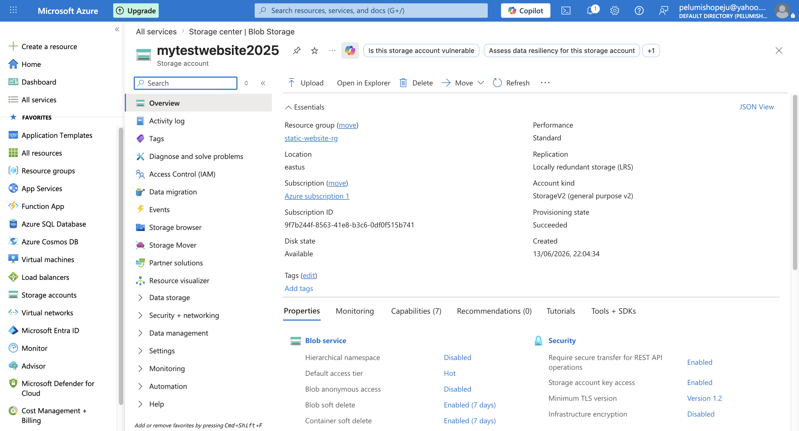
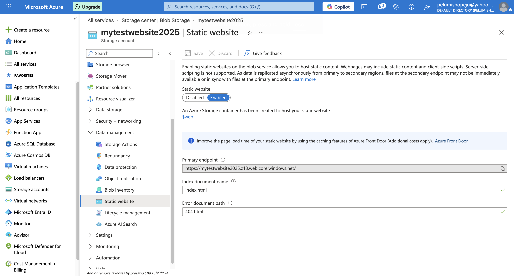
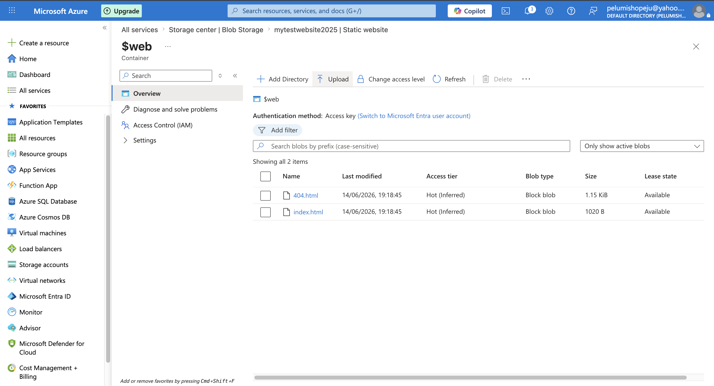
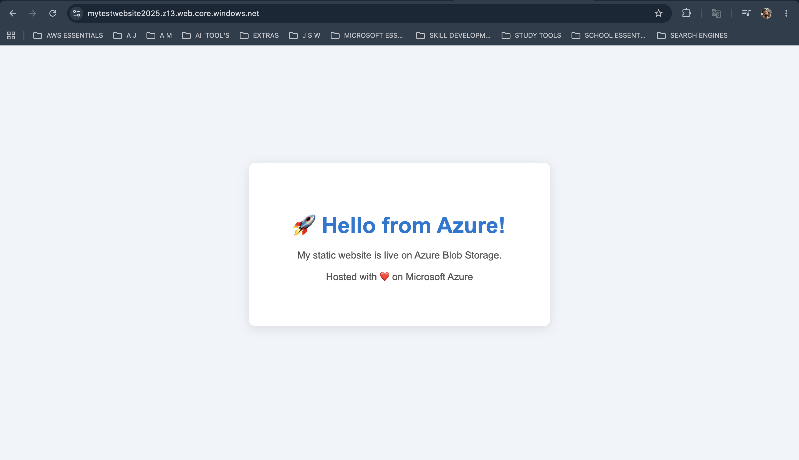
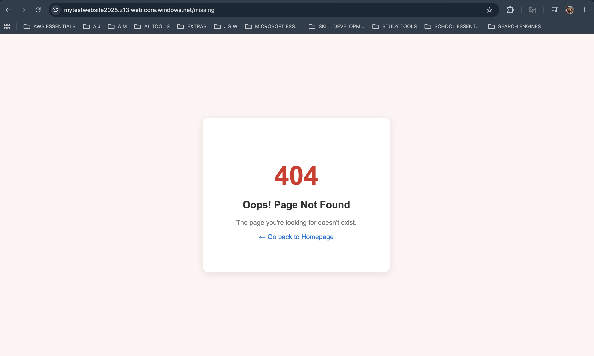

# Azure Blob Storage — Static Website Hosting

## Live URL
https://mytestwebsite2025.z13.web.core.windows.net/

## Project Overview
This project demonstrates how to host a static website using Azure Blob Storage
Static Website Hosting — a serverless, cost-effective alternative to traditional
web servers like Apache or Nginx.

## Architecture Summary
- **Cloud Provider:** Microsoft Azure
- **Service Used:** Azure Blob Storage (StorageV2)
- **Hosting Method:** Static Website Hosting via $web container
- **Region:** East US
- **Performance Tier:** Standard
- **Redundancy:** Locally Redundant Storage (LRS)

## How It Works
1. A Storage Account (mytestwebsite2025) was provisioned in Azure
2. Static Website Hosting was enabled — this auto-created a $web container
3. index.html and 404.html were uploaded into the $web container
4. Azure serves these files publicly via a dedicated endpoint URL
5. Any unknown path automatically serves the custom 404.html error page

## Design Decisions

### Why Standard Performance?
Standard performance uses HDD-backed storage and is ideal for static websites
with low to moderate traffic. Premium performance (SSD-backed) is designed for
high-throughput workloads like databases — unnecessary and more expensive for
a simple static site.

### Why LRS (Locally Redundant Storage)?
LRS stores 3 copies of data within a single Azure data centre. For a learning
project and low-traffic static site, LRS is the most cost-effective option
at roughly $0.018 per GB per month. GRS (Geo-Redundant Storage) would replicate
data across regions but at higher cost — not justified for this use case.

### Why Azure Blob Storage instead of a VM?
No server to manage, no OS to patch, no web server software to configure.
Azure handles availability, scaling, and HTTPS automatically.

## Screenshots

## Files
| File | Purpose |
|------|---------|
| index.html | Homepage served at the root URL (/) |
| 404.html | Custom error page for missing paths |

## Tech Stack
- HTML5 + CSS3
- Microsoft Azure Blob Storage
- Azure Static Website Hosting
